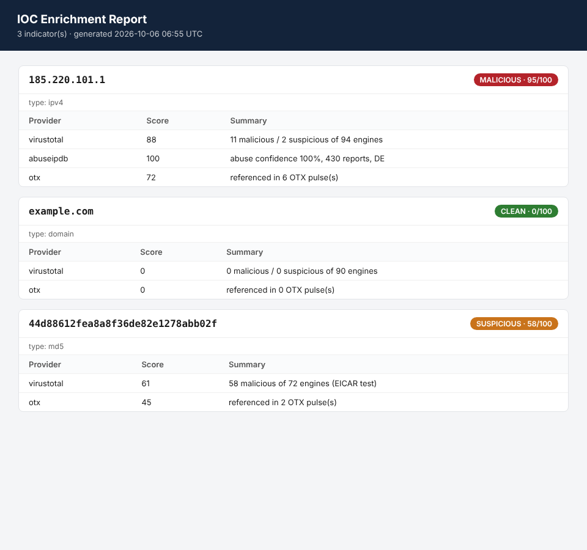

# IOC Enricher

Automated threat-intelligence enrichment for indicators of compromise. Feed it
IPs, domains, URLs, or file hashes and it queries multiple reputation feeds in
parallel, blends the verdicts into a single explainable risk score, and prints a
triage table, JSON, or a styled HTML report.

Built to answer the first question in any alert triage: *is this indicator
known-bad, and how confident are we?*



## Why

During alert triage an analyst copies an IP or hash out of a SIEM alert and
checks it against a handful of feeds by hand. This tool collapses that loop into
one command, de-duplicates bulk indicator dumps so you do not burn free-tier
quota, and produces an artifact you can attach to a ticket.

## Features

1. Detects indicator type automatically: IPv4, domain, URL, MD5, SHA1, SHA256.
2. Re-fangs defanged indicators (`hxxp`, `bad[.]com`) pasted from reports and
   email headers.
3. Skips private / non-routable addresses instead of wasting a lookup on them.
4. Queries providers concurrently and degrades gracefully: a missing API key or
   a failed call becomes a "skipped" row, never a crash.
5. Blends provider scores into one 0-100 score and a band
   (clean / low / suspicious / malicious).
6. Outputs a terminal table, JSON (for piping into other tooling), or HTML.

## Supported feeds

| Provider          | Indicators            | Env var              |
| ----------------- | --------------------- | -------------------- |
| VirusTotal        | IP, domain, URL, hash | `VT_API_KEY`         |
| AbuseIPDB         | IP                    | `ABUSEIPDB_API_KEY`  |
| AlienVault OTX    | IP, domain, hash      | `OTX_API_KEY`        |

All three have free tiers. The tool runs with whatever keys you set; unset feeds
are skipped.

## Install

```bash
git clone https://github.com/AbdulMoeezMukadam/ioc-enricher.git
cd ioc-enricher
pip install -r requirements.txt
```

## Usage

```bash
# set whichever keys you have
export VT_API_KEY=...
export ABUSEIPDB_API_KEY=...
export OTX_API_KEY=...

# single indicator
python -m iocenricher.cli 185.220.101.1

# a file of indicators, one per line, as an HTML report
python -m iocenricher.cli -f samples/sample-indicators.txt --format html -o report.html

# pipe indicators in from another tool, get JSON out
cat iocs.txt | python -m iocenricher.cli --format json
```

### Example (table)

```
INDICATOR                                 TYPE     SCORE  BAND
----------------------------------------------------------------------
185.220.101.1                             ipv4     95     malicious
example.com                               domain   0      clean
44d88612fea8a8f36de82e1278abb02f          md5      58     suspicious
```

## How the score works

Each provider is flattened to a 0-100 contribution. The final score is
`0.6 * max + 0.4 * mean` of the available provider scores. Taking the max as a
floor means one confident reputable feed is enough to raise an indicator to
suspicious, while the mean keeps a single noisy feed from pushing everything to
malicious on its own. Bands: `>=75` malicious, `>=40` suspicious, `>=10` low,
below that clean. See [`scoring.py`](iocenricher/scoring.py).

## Project layout

```
iocenricher/
  indicators.py   type detection, refang, private-range filtering
  providers.py    one class per feed, all best-effort
  scoring.py      normalise + blend provider verdicts
  engine.py       orchestration, concurrency, de-dup
  report.py       table / JSON / HTML renderers
  cli.py          argparse entry point
tests/            offline unit tests (providers stubbed)
samples/          example input, demo report + screenshot
```

## Tests

```bash
pip install pytest
python -m pytest tests/ -q
```

Tests are fully offline. Providers are stubbed, so no keys or network are
needed to verify the classification, scoring, and engine logic.

## Generate the demo report

```bash
python samples/make_demo_report.py   # writes samples/demo-report.html
```

## Roadmap

- Add Shodan and GreyNoise providers.
- Local response cache with a TTL to cut repeat lookups.
- STIX 2.1 bundle export.

## Disclaimer

For defensive security operations and authorised investigation only. Respect the
terms of service and rate limits of each API provider.

## License

MIT. See [LICENSE](LICENSE).
